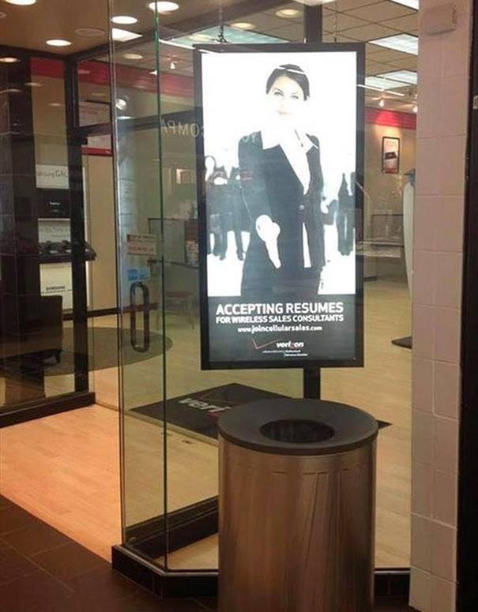

### Who Am I?

Site: <a>Jason.Land</a>

- Full Stack Developer at Diego Dev

- Co-organizer at <a>meetup.com/sandiegojs</a>

- Previously Tipsy Elves, The Control Group, Origin Code Academy, Touch This Media

- Curator of <a>n00b.news</a> (those are zeroes)

---
# How to Get Hired

---
## So you need a job

---
# Don't Panic
<h2 class="fragment">Keep living life</h2>

<ul>
    <li class="fragment">Eat Right</li>
    <li class="fragment">Get Sleep</li>
    <li class="fragment">See your friends/family</li>
</ul>

---
## What Do You Want?
<ul>
    <li class="fragment">Front/back end or full stack?</li>
    <li class="fragment">Startup, enterprise, contract, non-profit?</li>
    <li class="fragment">SaaS, B2B, B2C, E-commerce?</li>
    <li class="fragment">Find what satisfies you</li>
</ul>

---
## Are You Experienced?
<ul>
    <li class="fragment">Every job description is a wish list</li>
    <li class="fragment">Unless it's wildly out of your skill set, you can probably get it</li>
    <li class="fragment">If you don't know something on the list, start Youtubing</li>
</ul>

---
## A Job is Just a Job
You are trading time and labor for capital.

Don't fall in love with a position.

<b class="fragment">It will never love you back.</b>

---
## Look online
Check out Indeed/Monster/etc

But don't use them to apply!

---
<h4>A typical job submission site</h4>

---
## Find out who's in charge
<h4 class="fragment">AKA</h4>
<h2 class="fragment">Start Stalking</h2>

---
## "No" Man

It's their job to say "no" to that stack of resumes from Indeed

It's your job to get them to not do that

 

---
## Target Acquisition
- Look at the company's staff page, find the senior developers (not the CTO)
- Check if they have in-house recruiters
- Contact someone in HR as a last resort

---
## Go Pro
- Get a LinkedIn Pro account
- Free for the first 30 days
- Send a direct message & connection request to your targets ⬆️

---
## Why does a Company Hire?
1. To save time
2. To save money
3. To do something they don't know how (which is really a combo of 1 & 2)

<h3 class="fragment">Your message needs to convey 1, 2, or 3</h3>

---
## Don't You Forget About Me
- Don't let more than 4 days go by without a message contact
- Don't harass, just ask if they've had a look at your resume
- Only give up after 14+ days of no response

---
## Be Accessible
- Setup a site w/screenshots/gifs of your app(s)
- No one has time to install the source so make a portfolio page
- Host it on Heroku or Now.sh
- Get a great README on your repos: https://bit.ly/2u0I8dr
- Host an HTML resume on your site w/PDF download

Practicing what I preach: <a>Jason.Land/resume</a>

---
## Look The part
- Business casual attire is fine, no tie needed
- Men: Get nice leather shoes, all black sneakers won't cut it
- Women: slacks & blouse are fine, no heels needed
- If they say don't wear a suit...

<h1 class="fragment">Don't wear a suit</h1>

---
## Walk the Walk
- Arrive 10 minutes early
- Accept a water if they ask you if you want something
- Go over your interview questions
- DO NOT TAKE OUT YOUR PHONE

You know what? Just leave it at home

---
- Bring a leather portfolio with:
    - 10+ copies of your resume
    - A pen
    - A blank pad of paper
    - A sheet of questions to ask them

---
## Talk the talk

Interviews are a two way street

- Questions from the updated Joel Test
- How long have the senior devs been at this company?
- Is there a mentor system in place?
- What would your ideal candidate look like 6 months from now?

<b class="fragment">YOU MUST ASK THEM QUESTIONS</b>

---
## Seal the Deal
<ul>
    <li >Speak as if you're a strong candidate</li>
    <li >Ask what the next steps are</li>
    <li >Thank them: <a>thankyouletter.ws</a></li>
    <li class="fragment">Remember the 4 day rule</li>
</ul>

---

---